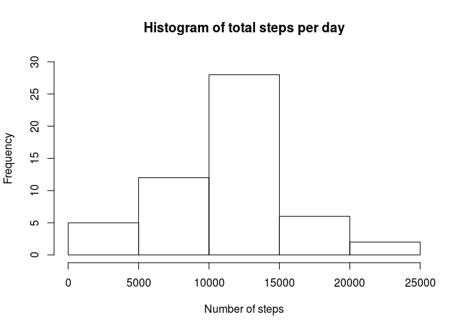
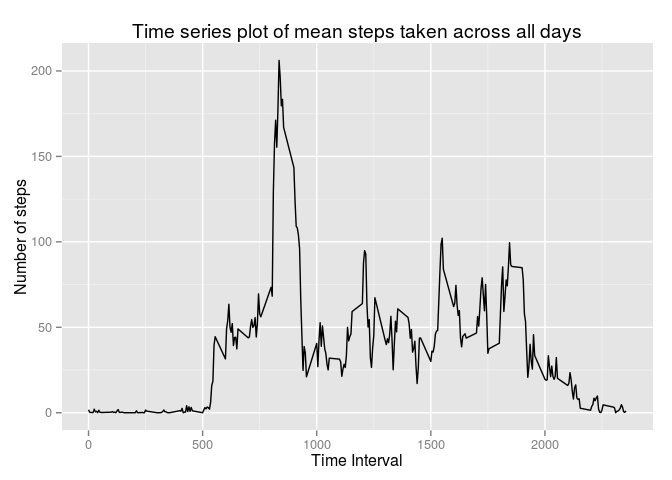
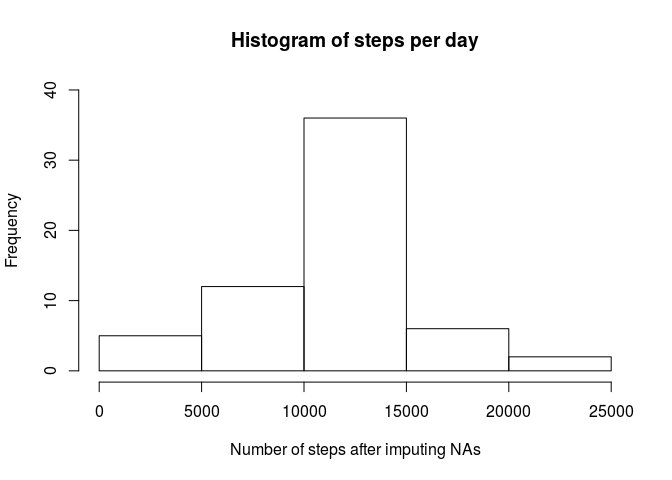
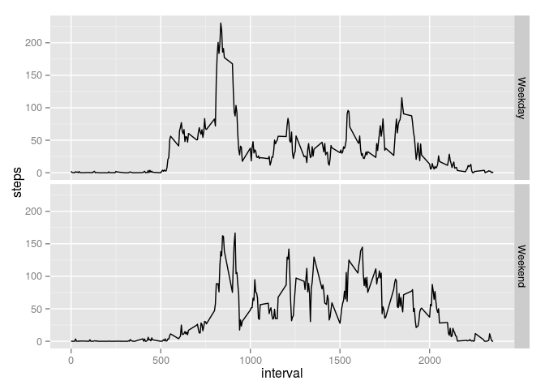

# Reproducible Research: Peer Assessment 1


```r
require(ggplot2)
require(dplyr)
```

## Loading and preprocessing the data
Read and clean the raw data by removing all rows with NA values

```r
mdata <- read.csv("activity.csv",header=TRUE)
clean_mdata <- mdata[complete.cases(mdata),]
```

## What is mean total number of steps taken per day?
Calculate total steps per day:

```r
total_steps_per_day <- with(clean_mdata, aggregate(steps ~ date, FUN = sum))
```

Histogram of number of steps taken per day:

```r
hist(x = total_steps_per_day$steps, xlab="Number of steps", ylab="Frequency",
ylim=c(0,30),main="Histogram of total steps per day")
```

 

**Mean/Median of total of steps per day over whole dataset:**

```r
mean_steps_tot <- mean(total_steps_per_day$steps)
median_steps_tot <- median(total_steps_per_day$steps)
```

The mean number of steps taken per day is **10766.1886792**.
The median number of steps taken per day is **10765**.

## What is the average daily activity pattern?
Calculate the mean steps taken during each interval across all days in dataset:

```r
time_data <- with(clean_mdata, aggregate(steps ~ interval, FUN = mean))
```

Time series plot of average steps taken during each interval

```r
mplot <- ggplot(time_data, aes(interval, steps)) + geom_point(size=0) + geom_line() + ylab("Number of steps") + 
ggtitle("Time series plot of mean steps taken across all days") + xlab("Time Interval")
print(mplot)
```

 


I will find the row number of the interval with the most number of steps, on average, is. Then, I will extract
the interval and its corresponding number of steps from the data frame.


```r
max_ind <- which(time_data$steps == max(time_data$steps),arr.ind=TRUE)
max_interval <- time_data[max_ind,1]
max_val <- time_data[max_ind,2]
```

**The time interval with the most number of steps, on average, is 835 with 206.1698113 number of steps.**


## Imputing missing values
Number of rows with NA values

```r
num_NA <- nrow(mdata) - nrow(clean_mdata)
```

**There are 2304 number of rows with NA values in the original dataset**.


#### Filling in NA values with means for each 5 minute interval
I will replace the NAs with the mean number of steps taken of the respective 5 minute intervals.
I will first find which rows have NA values. Then I will go through the list of rows that contain NAs and replace it with the
mean number of steps taken of the respective 5 minute intervals.

```r
NA_rows <- which(is.na(mdata$steps), arr.ind=TRUE)

mdata_no_NA <- mdata
mdata_no_NA$interval <- as.numeric(mdata_no_NA$interval)

for(i in NA_rows) {
	mdata_no_NA[i,1] <- time_data[which(time_data$interval == mdata_no_NA[i,3], arr.ind=TRUE),2]
}
```

Histogram of total steps taken each day after imputing NAs.


```r
total_steps_per_day <- with(mdata_no_NA, aggregate(steps ~ date, FUN = sum))
hist(x = total_steps_per_day$steps, xlab="Number of steps after imputing NAs", ylab="Frequency",ylim=c(0, 40),
main="Histogram of steps per day")
```

 

Mean/Median of total of steps per day

```r
mean_steps <- mean(total_steps_per_day$steps)
median_steps <- median(total_steps_per_day$steps)
```

The mean number of steps taken per day after imputing NAs is **10766.1886792**.
The median number of steps taken per day after imputing NAs is **10766.1886792**.

After imputing NAs, the mean has stayed the same while the median has changed slightly.

## Are there differences in activity patterns between weekdays and weekends?

Convert 'date' to Date class and add factor variable to indicate if date is weekday or weekend

```r
mdata_no_NA$date <- as.Date(mdata_no_NA$date)
mdata_no_NA$day <- weekdays(mdata_no_NA$date)
mdata_no_NA$day_type <- as.factor(ifelse(mdata_no_NA$day %in% c("Saturday", "Sunday"), 
"Weekend", "Weekday"))
```

Sum the average steps taken during each interval differentiating between weekday/weekend

```r
data <- with(mdata_no_NA, aggregate(steps ~ interval + day_type, FUN=mean))
```

Plot of average steps taken during each interval differentiating between weekday/weekend

```r
mplot <- ggplot(data, aes(interval, steps)) + geom_point(size=0) + geom_line() + 
facet_grid(day_type ~ .)
print(mplot)
```

 
